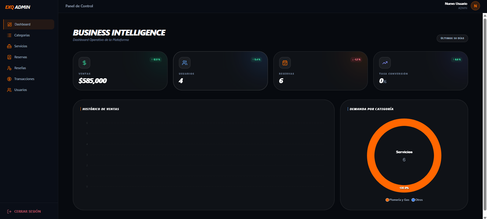
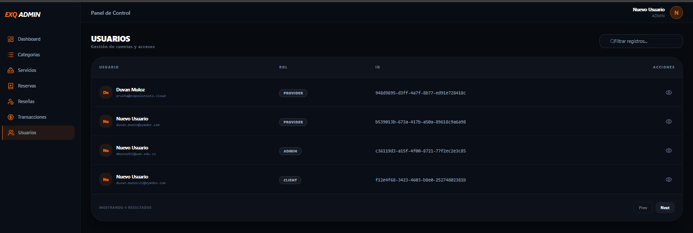
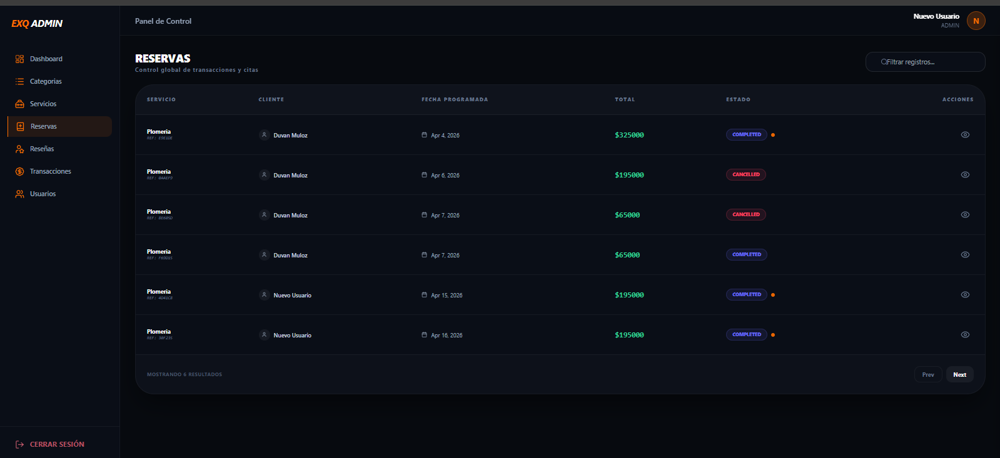
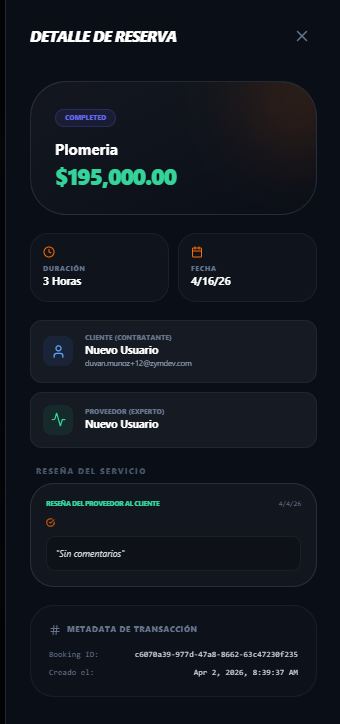

# **🛡️ Services Marketplace \- Admin Control Panel**

Este es el **Centro de Mando** del ecosistema. Un portal web de acceso restringido diseñado exclusivamente para la administración global de la plataforma, permitiendo la gestión de entidades y la visualización de métricas críticas del negocio.

---

## **📊 Business Intelligence & Management**

El portal se divide en dos pilares fundamentales:

### **1\. Dashboard de Estadísticas (Insights)**

Visualización en tiempo real de los KPIs del Marketplace:

* **Métricas de Volumen:** Total de servicios completados, usuarios activos y flujo de reservas.  
* **Métricas Financieras:** Reporte de ingresos y comisiones.  
* **Rendimiento:** Gráficos comparativos de los servicios más demandados.

### **2\. Gestión de Entidades (CRUD Maestro)**

Control total sobre la base de datos del sistema:

* **Usuarios & Proveedores:** Activación, bloqueo y verificación de perfiles.  
* **Catálogo de Servicios:** Gestión de categorías y moderación de ofertas.  
* **Auditoría de Reservas:** Supervisión de todo el historial de transacciones.

---

## 📸 Interfaz Administrativa

### 📊 Gestión Global (Escritorio)
| Panel de Estadísticas | Gestión de Usuarios | Control de Reservas |
| :---: | :---: | :---: |
|  |  |  |

### 🔍 Inspección de Datos
Para un control total, el administrador puede acceder a vistas de detalle profundo para cada entidad:

  
   
  <i>Vista detallada de transacciones y metadatos del servicio</i>

---

## **🛠️ Stack Técnico Administrativo**

* **Framework:** Angular 19 (Optimizado para SPAs de alto rendimiento).  
* **Charts & Data Viz:** \[ApexCharts\] para la representación de estadísticas.  
* **UI Framework:**  Tailwind CSS (Diseño sobrio y funcional).  
* **Seguridad:**  
  * **Role-Based Access Control (RBAC):** Guards de Angular que restringen el acceso solo a perfiles ADMIN.  
  * **HTTP Interceptors:** Inyección automática de JWT para peticiones protegidas hacia NestJS.

---

## **⚙️ CI/CD & Despliegue**

El flujo de integración asegura que las herramientas administrativas siempre sean funcionales:

1. **Validación de Build:** Compilación estricta para detectar errores en tipos de datos complejos.  
2. **Environment Mocks:** Generación de variables de entorno para pruebas en el pipeline.  
3. **Deployment Ready:** Configuración lista para despliegue en entornos seguros detrás de VPN o Firewalls.

